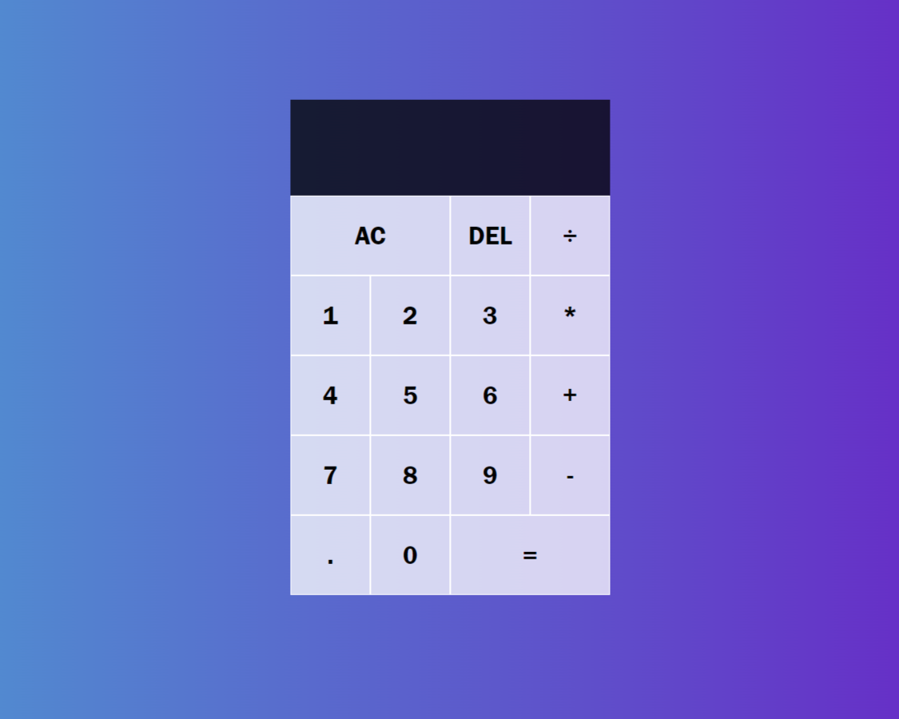

# JavaScript Calculator

## Description
This is a simple JavaScript calculator implemented using HTML, CSS, and JavaScript. It allows users to perform basic arithmetic operations such as addition, subtraction, multiplication, and division. This is a desktop browser application and is not intended for mobile use.

## Deployed Application

[Click Me!](https://drbubblez.github.io/JavaScript-Calculator/)

## Table of Contents
- [Installation](#installation)
- [Usage](#usage)
- [License](#license)
- [Contributing](#contributing)
- [Tests](#tests)
- [Questions](#questions)

## Installation
For local development, just clone the repository and open in VS-Code.

## Usage
To use the calculator, simply open the `index.html` file in your web browser. The calculator will appear and you can use it to perform basic arithmetic operations.
- Press the numbers to input them into the calculator.
- Press the `+`, `-`, `*`, or `/` buttons to perform addition, subtraction, multiplication, or division, respectively.
- Press the `=` button to calculate the result.
- Press the `AC` button to clear the calculator.
- Press the `DEL` button to delete the last input.

## License
This project is licensed under the MIT license. For more information, see the [LICENSE](./LICENSE) file.

## Contributing
No contributions are needed but feel free to clone and modify the code as you see fit.

## Tests
No tests are needed for this project.

## Questions
If you have any questions, please contact me at harrisonminer59@gmail.com or visit my GitHub page at https://github.com/DrBubblez.